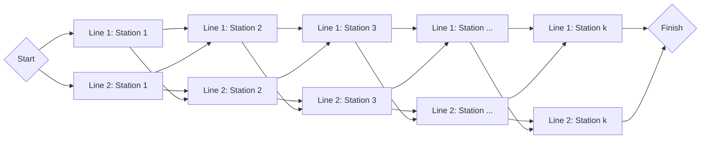
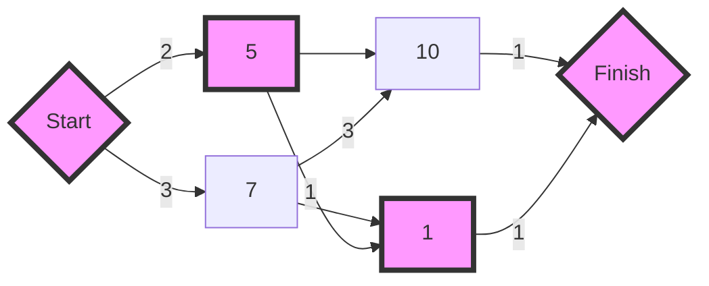
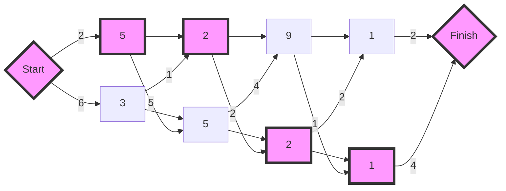

# The Assembly Line Scheduling Problem

## Purpose
The coding exercises are designed to test your knowledge of the following concepts:
* The ALS problem
* Approaching the ALS problem with dynamical programming

## Overview
The coding exercise covers the following practical problem:
* Solving the ALS problem

## Coding exercises

### Exercise 1: Solving the ALS problem



Let's consider the following `Assembly Line Scheduling Problem`:
* 2 lines
* $k$ stations
* It takes `startCosts(i)` minutes to deliver the product to one of the lines, where $i \in \{1, 2\}$
* It takes `stationCosts(i, j)` minutes to process the product on the $i$-th station of the line $j$, where $i \in \overline{1..k}$, $j \in \{1, 2\}$
* It takes `transferCosts(i, j)` minutes to transfer the product from the $i$-th station of the line $j$ to the station $i+1$ of the other line, where $i \in \overline{1...{k-1}}$, $j \in \{1, 2\}$
* It takes `finishCosts(i)` minutes to finish the processed product (after all stations), where $i \in \{1, 2\}$


Your task is to implement the following static method to find the solution to the `Assembly Line Scheduling` problem described above:

```java
import org.javatuples.Pair;

/**
    * Returns the solution to the ALS problem based on given target parameters.
    *
    * NOTE: |stationCosts[0]| = |stationCosts[1]| = k, which is defined implicitly.
    * 
    * NOTE: |transferCosts[0]| = |transferCosts[1]| = k-1
    * 
    * NOTE: if there are multiple solutions (line indices for stations), you can return any of them.
    * 
    * @param startCosts time in minutes required to deliver the product 
    *     to the first and second lines, respectively, before processing.
    * @param stationCosts time in minutes required to process 
    *     the product on the first and second lines for all stations.
    * @param transferCosts time in minutes required to transfer
    *     the product to another line after processing on some station.
    * @param finishCosts time in minutes required to finish up the product
    *     on the last station for two lines, respectively.
    * @return the optimal time that it takes to process the product on 
    *     all stations (including start and finish times) and the optimal sequence of line indices
    *     (per station) where the product should be processed for the corresponding station index.
    */
public static Pair<Integer, Integer[]> solveAlsProblem(
    Pair<Integer, Integer> startCosts,
    Pair<Integer[], Integer[]> stationCosts,
    Pair<Integer[], Integer[]> transferCosts,
    Pair<Integer, Integer> finishCosts
)
```

**Example 1:**

`startCosts`=[2, 3]

`stationCosts`=[[5, 10], [7, 1]]

`transferCosts`=[[1], [3]]

`finishCosts`=[1, 1]



Expected output: [10, [1, 2]]

Explanation:

The optimal time it takes to produce the product is 10 minutes.

First, the product must be put on the first line (station 1) and then transferred to the second line.

10 = 2 (starting on line 1) + 5 (station 1 on line 1) + 1 (transfer to line 2) + 1 (station 2 on line 2) + 1 (finishing on line 2).

**Example 2:**
`startCosts`=[2, 6]

`stationCosts`=[[5, 2, 9, 1], [3, 5, 2, 1]]

`transferCosts`=[[5, 2, 1], [1, 4, 2]]

`finishCosts`=[2, 4]



Expected output: [18, [1, 1, 2, 2]]

Explanation:

The optimal time it takes to produce the product is 18 minutes.

First the product must be put on the first line (station 1), the same line (station 2), transferred to line 2 (station 3), and the same line (station 4).

18 = 2 (starting on line 1) + 5 (station 1 on line 1) + 2 (station 2 on line 1) + 2 (transfer to line 2) + 2 (station 3 on line 2) + 1 (station 4 on line 2) + 4 (finishing on line 2).

<br/>

Please use the template `Solution.solveAlsProblem` for the implementation.
