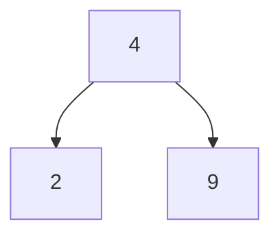
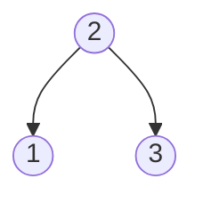
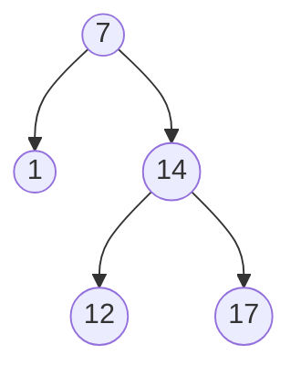
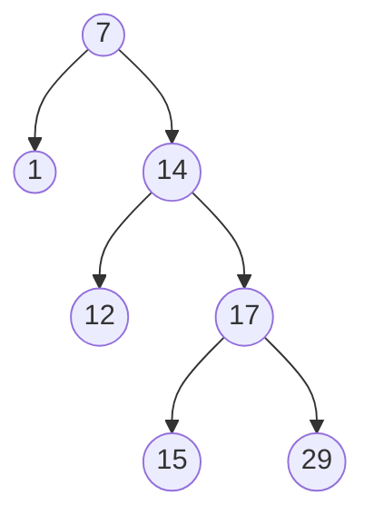
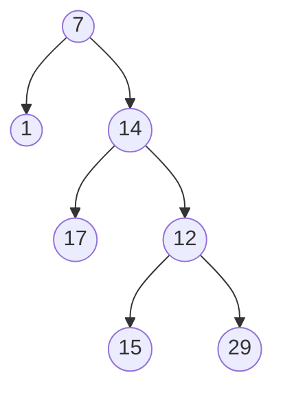
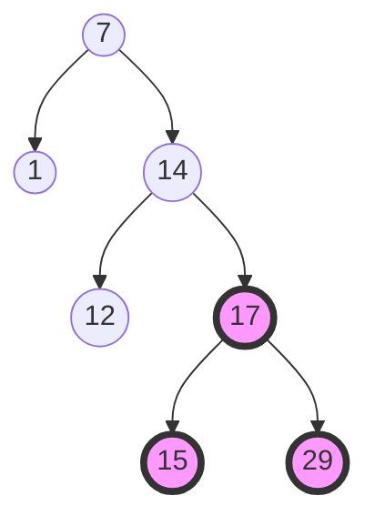
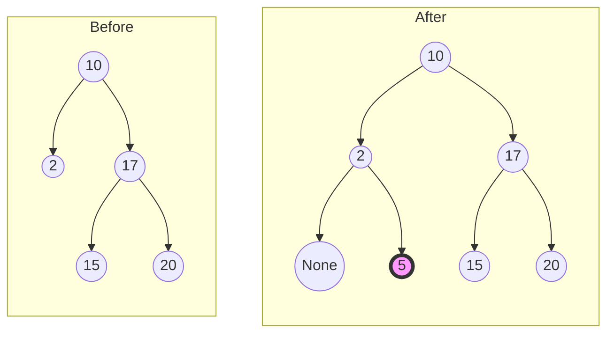
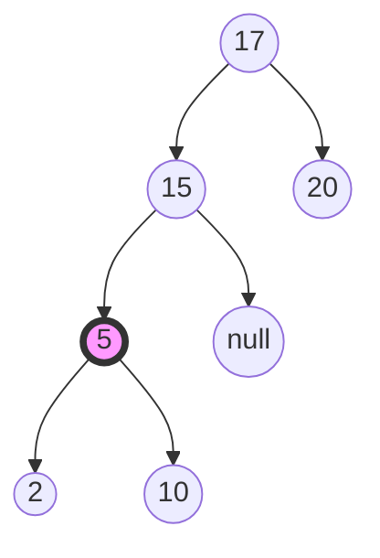

# Binary Search Tree

## Purpose

The following coding exercises are designed to test your knowledge of the following concepts:
* Properties of BSTs
* Operations with BSTs

## Overview

The coding exercises cover the following practical problems:
* Checking whether a given binary tree is height-balanced
* Checking whether a given binary tree is a BST
* Implementing the `search` operation for a BST
* Implementing the `insert` operation for a BST

## Coding exercises

### Basic data structure for representing BSTs

For all coding exercises, assume the following data class will be used to represent tree nodes:

```java
public class TreeNode<E extends Comparable<E>> {

    /**
     * Data part
     */
    private E element;
    /**
     * Links to the left and right nodes
     */
    private TreeNode<E> left;
    private TreeNode<E> right;

}
```

For example, the following tree can be created using the snippet below:



```
b = new TreeNode<Integer>(2);
c = new TreeNode<Integer>(9);
a = new TreeNode<Integer>(4, b, c);
```

### Exercise 1: Check whether a given binary tree is height-balanced

Determine whether a given binary tree is height-balanced.

For this problem, a height-balanced binary tree is defined as:

> a binary tree in which the left and right subtrees of every node differ in height by no more than 1.

**Example 1:**


Expected result: True.

**Example 2:**


Expected result: True.

**Example 3:**


Expected result: False.

<br>

Please update the method `isBalanced` for the implementation.


### Exercise 2: Check whether a given binary tree is a BST

Given an instance of a binary tree, *determine if it is a valid BST*.

A valid BST is defined as follows:

* The left subtree of a node contains only nodes with keys **less than** the node's key.
* The right subtree of a node contains only nodes with keys **greater than** the node's key.
* Both the left and right subtrees must also be BSTs.

**Example 1:**


Expected result: True.

**Example 2:**


Expected result: True.

**Example 3:**


Expected result: False.

<br>

Please update the method `isBinarySearchTree` for the implementation.


### Exercise 3: Implement the search operation for a BST

Given an instance of a binary tree (BST) and an `element` of a type `E`.

Find the node in the BST whose value equals `element`,
and return the subtree rooted with that node. If no such node exists, return `null`.


**Example:**

`element=17`


Expected result: a node with the value 17.

Please update the method `searchInBst` for the implementation.


### Exercise 4: Implement the insert operation for a BST

Given an instance of a BST and an `element` of a type `E` 
to insert into the tree. Return *the BST after the insertion*.
It is **guaranteed** that the new `element` does not exist in the original BST.

**Notice** that there may exist multiple valid ways to do the insertion, but the tree must remain a BST after insertion. You can return **any of them**.

**Example:**

`element=5`



Explanation: another accepted tree is:



<br>

Please update the method `insertInBst` for the implementation.
