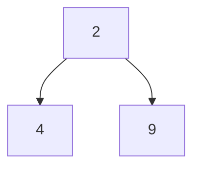
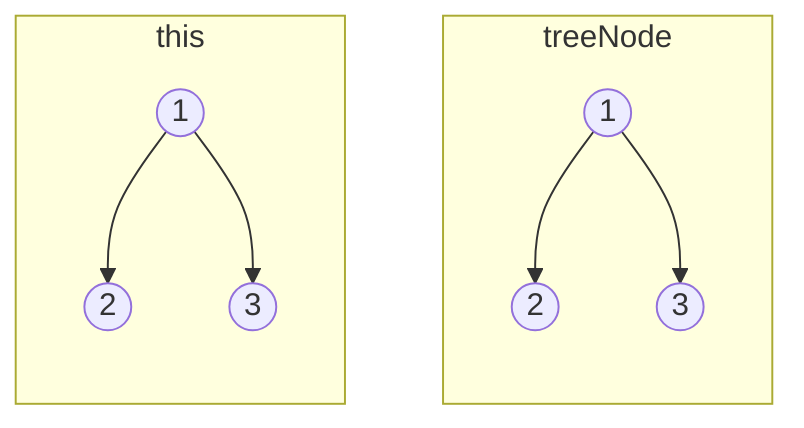
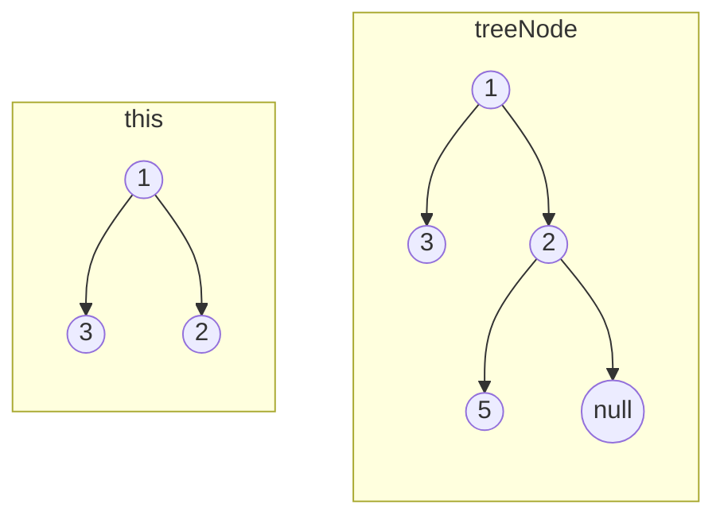
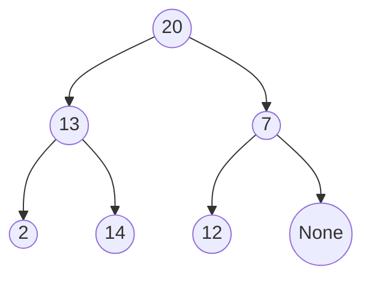

# Binary Tree Traversal

## Purpose

The following coding exercises are designed to test your knowledge of the following concepts:
* Binary tree
* Binary tree traversals (inorder, postorder, preorder, level order)

## Overview

The coding exercises cover the following practical problems:
* Checking whether two binary trees are identical
* Getting the inorder traversal for a given binary tree
* Getting the postorder traversal for a given binary tree
* Getting the preorder traversal for a given binary tree
* Getting the level order traversal for a given binary tree

## Coding exercises

### Basic data structure for representing binary trees

Assume for all coding exercises, the following data class will be used to represent tree nodes:

```java
public class TreeNode<E> {

    /**
     * Data part
     */
    private E element;
    /**
     * Links to the left and right nodes
     */
    private TreeNode<E> left;
    private TreeNode<E> right;

}
```

For example, the following tree could be created using the snippet below:



```
b = new TreeNode<Integer>(4);
c = new TreeNode<Integer>(9);
a = new TreeNode<Integer>(2, b, c);
```

### Exercise 1: Check whether two trees are the same

Given the roots of two binary trees `this` and `treeNode`, write a method 
to check if they are the same or not.

Two binary trees are considered the same 
if they are structurally identical, and the nodes have the same value.

**Example 1:**


Expected result: True.

**Example 2:**


Expected result: False.

**Example 3:**


Expected result: False.

<br>

Please update the method `check` for the implementation.

### Exercise 2: Get the inorder traversal of a binary tree

Given an instance of a binary tree, 
return the inorder traversal of its nodes' elements.

**Example:**


Expected result: [2, 13, 14, 20, 12, 7].

<br>

Please update the method `getInorderTraversal` for the implementation.

### Exercise 3: Get postorder traversal of binary tree

Given an instance of a binary tree,
return the postorder traversal of its nodes' elements.

**Example:**


Expected result: [2, 14, 13, 12, 7, 20].

<br>

Please update the method `getPostorderTraversal` for the implementation.

### Exercise 4: Get the preorder traversal of a binary tree

Given an instance of a binary tree,
return the preorder traversal of its nodes' elements.

**Example:**


Expected result: [20, 13, 2, 14, 7, 12].

<br>

Please update the method `getPreorderTraversal` for the implementation.

### Exercise 5: Get the level order traversal of a binary tree

Given an instance of a binary tree,
return the level order traversal of its nodes' elements.

**Example:**


Expected result: [20, 13, 7, 2, 14, 12].

<br>

Please update the method `getLevelOrderTraversal` for the implementation.
