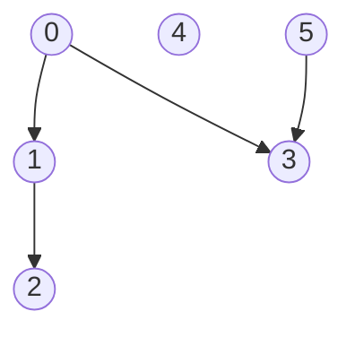
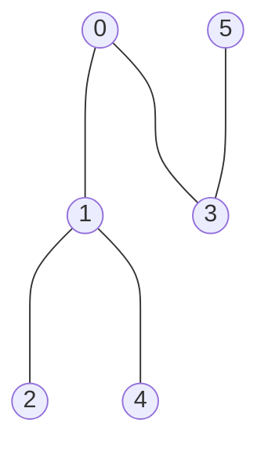
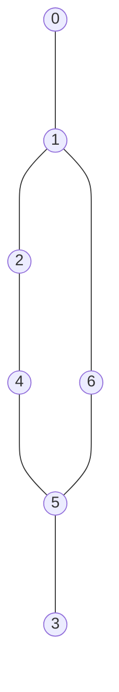
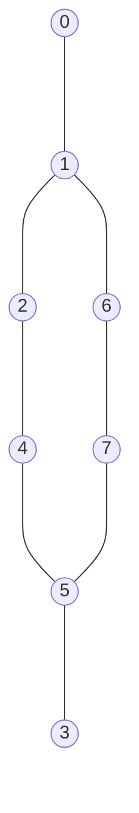
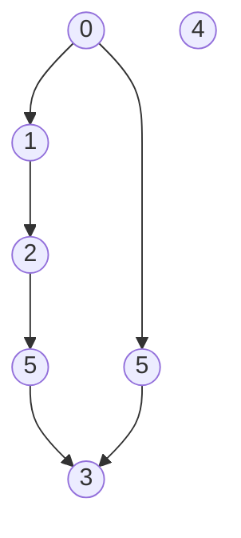
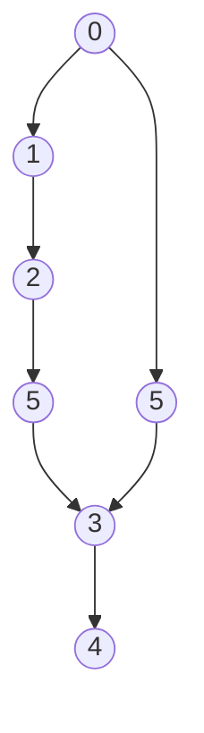

# Depth-first search

## Purpose

The coding exercises are designed to test your knowledge of the following concepts:

* DFS traversal

## Overview

The coding exercises cover the following practical problems:
* Checking to see if a (v, u)-path exists in a directed graph
* Checking to see if an undirected connected graph is bipartite
* Finding the length of the longest eligible path in a directed acyclic graph

## Coding exercises

### Exercise 1: Check to see if a (v, u)-path exists in a directed graph

Given the number of vertices `n`, graph edges (adjacency dictionary) `edges`, and vertices `vertexV` and `vertexU` for a directed graph, implement the static method below to check whether a (vertexV, vertexU)-path exists or not. Vertices are enumerated from `0` to `n-1`.

```java
/**
 * Returns true/false depending on the existence of an eligible path 
 * from vertex vertexV to vertex vertexU in a directed graph.
 * 
 * For example, you have a graph with five vertices from 0 to 5 exclusively and the edges {1: {0, 3}, 0: {2}, 3: {4}}.
 * There is a path from vertex 1 to vertex 4: 1 -> 3 -> 4, so for v=1 and u=4, the method should return true.
 * At the same time, no path exists from vertex 2 to vertex 0, so the expected result is false.
 * 
 * @param n the number of vertices in the graph, vertices are enumerated from 0 to n exclusively.
 * @param edges the adjacency dictionary which stores a set of adjacent vertices for each vertex.
 * @param vertexV the start vertex of the path of interest.
 * @param vertexU the end vertex of the path of interest.
 * @return true or false, depending on whether a (vertexV, vertexU)-path exists.
 */
public static boolean checkPathExistence(
        int n,
        Map<Integer, Set<Integer>> edges,
        int vertexV,
        int vertexU
        ) {
    //put your code here
    return false;
}
```

**Example 1:**

`vertexV` = 0, `vertexU` = 2

Expected result: true


**Example 2:**

`vertexV` = 3, `vertexU` = 1

Expected result: false

<br/>

Please use the template `Solution.checkPathExistence` for the implementation.

### Exercise 2: Check to see if an undirected connected graph is bipartite

Given the number of vertices `n` and graph edges (adjacency dictionary) `edges` for an undirected connected graph, implement the static method below so that it returns true if graph is bipartite and false if not. Vertices are enumerated from `0` to `n` exclusively. 

```java
/**
 * Returns true/false if a connected undirected graph is bipartite or not.
 * 
 * For example, you have a graph with five vertices from 0 to 5 exclusively and the edges
 *   {0: {1}, 1: {0, 2}, 2: {1, 3}, 3: {2, 4}, 4: {3}.
 * This graph is bipartite because you can select two sets of vertices, {0, 2, 4} and {1, 3}, that don't have inner edges.
 * 
 * @param n the number of vertices in the graph, vertices are enumerated from 0 to n exclusively.
 * @param edges the adjacency dictionary which stores a set of adjacent vertices for each vertex.
 * @return true if a graph is bipartite or false otherwise
 */
public static boolean checkBipartiteGraph(int n, Map<Integer, Set<Integer>> edges) {
    //put your code here
    return false;
}
```

**Example 1:**


Expected result: true.

**Example 2:**


Expected result: false.

**Example 3:**


Expected result: true.

<br/>

Please use the template `Solution.checkBipartiteGraph` for the implementation.

### Exercise 3: Find the length of the longest eligible path in a directed acyclic graph

Given the number of vertices `n`, graph edges (adjacency dictionary) `edges` for a directed acyclic graph, implement the static method below so that it returns the length of the longest eligible path. Vertices are enumerated from `0` to `n` exclusively.

```java
/**
 * Returns the length of the longest path in a directed acyclic graph.
 * 
 * For example, you have a graph with five vertices from 0 to 5 and the edges 
 *   {4: {3}, 3: {2}, 2: {1}, 1: {0}}.
 * The longest path is (4, 0)-path: 4 -> 3 -> 2 -> 1 -> 0. The expected result is 4.
 *
 * @param n the number of vertices in the graph, vertices are enumerated from 0 to n exclusively.
 * @param edges the adjacency dictionary which stores a set of adjacent vertices for each vertex.
 * @return the length of the longest eligible path in a graph
 */
public static int getLengthOfLongestPathInDAG(int n, Map<Integer, Set<Integer>> edges) {
    //put your code here
    return 0;
}
```

**Example 1:**


Expected result: 2

**Example 2:**


Expected result: 4

**Example 3:**


Expected result: 5

<br/>

Please use the template `Solution.getLengthOfLongestPathInDAG` for the implementation.
