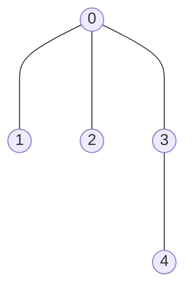
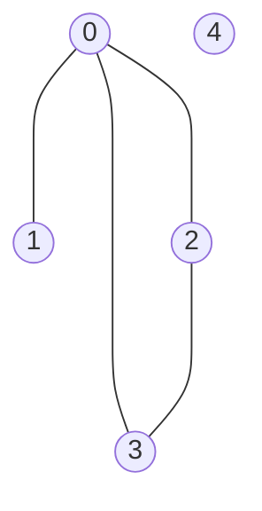
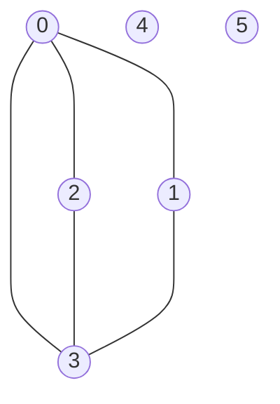

# Disjoint Sets

## Purpose

The following coding exercises are designed to test your knowledge of the following concepts:

* A disjoint set data structure and API

## Overview

The coding exercises cover the following practical problems:
* Implementing data structure of disjoint sets
* Checking whether a given graph is a tree

## Coding exercises

### Exercise 1: Implement Disjoint Sets data structure

Your task is to implement the provided interface below for a disjoint sets data structure.

```java
/**
 * Class for supporting disjoint sets.
 * NOTE: the expected implementation should contain:
 * "path compression" heuristic
 * "union be rank" heuristic (based on sets size)
 *
 * @param <K> type of key
 */
public class DisjointSets<K> {

    //Think about required fields to support the requirements.
    //define fields here

    /**
     * Creates a new set that is associated with a given key.
     * @param key the key
     */
    public void makeSet(K key) {
        //put your code here
    }

    /**
     * Returns a unique set identifier (key) of a given's key set.
     * NOTE: "path compression" heuristic should be used.
     *
     * @param key the key
     * @return the unique set identifier
     */
    public K findSet(K key) {
        //put your code here
        return null;
    }

    /**
     * Joins two given sets into a new one.
     * NOTE: "union by rank" heuristic should be used (based on sets size).
     * NOTE: if the sets that correspond to the given keys are of the same rank,
     * if is preferable to use the second set when deciding what set is to be used as a new 'root'.
     *
     * @param firstKey the key of a first set
     * @param secondKey the key of a second set
     */
    public void unionSets(K firstKey, K secondKey) {
        //put your code here
    }

}
```

<br/>

Please use the template `DisjointSets.java` for the implementation.

### Exercise 2: Check whether a given graph is a tree

You have a graph of `n` nodes labeled from `0` to `n - 1`. 
You are given an integer `n` and a list of `edges` 
where `edges[i] = (a_i, b_i)` indicates 
that there is an undirected edge between nodes `a_i` and `b_i` in the graph.

Return `true` *if the edges of the given graph make up a valid tree, and `false` otherwise*.

Your task is to implement the following static method 
to solve the problem above:

```java
    /**
     * Checks whether a given graph is a valid tree.
     *
     * @param n number of vertexes in a given graph.
     * @param edges list of edges of a given graph.
     * @return whether a given graph is a valid tree.
     */
    public static boolean isValidTree(int n, List<Pair> edges) {
        //put yor code here
        return false;
    }
```

The nested class Pair is implemented in the template completely.

**Example 1:**


Input:

n = 5

edges = [(0, 1), (0, 2), (0, 3), (3, 4)]


Expected result: true.

**Example 2:**


Input:

n = 5

edges = [(0, 1), (0, 2), (0, 3), (2, 3)]


Expected result: false.

**Example 3:**


Input:

n = 6

edges = [(0, 1), (0, 2), (0, 3), (2, 3), (0, 3)]


Expected result: false.

<br>

Please use the template `Solution.java` for the implementation.

