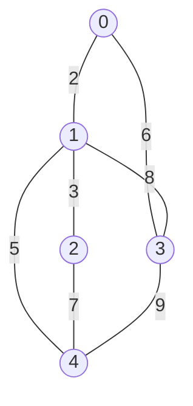
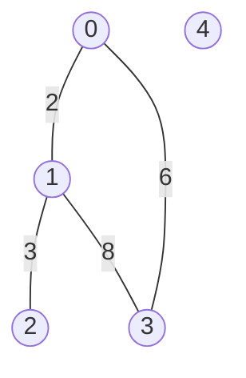
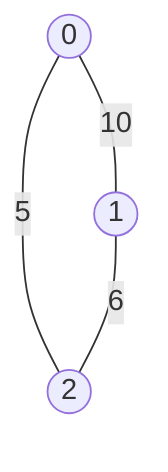

# Floyd-Warshall algorithm
 
## Purpose 
 
The coding exercise is designed to test your knowledge of the following concepts: 
 
* The Floyd-Warshall algorithm 
 
## Overview 
 
The coding exercise covers the following practical problems: 
* Finding the all-pairs shortest path 

## Coding exercises 
 
### Exercise 1: Finding all-pairs shortest path 
 
Given the number of vertices `n` and the graph adjacency matrix `adjacencyMatrix` of an undirected weighted graph, implement the function below to return two values. The first one is the sum of the all-pairs shortest paths between all connected vertices. The second is the number of disconnected pairs of vertices in an undirected weighted graph.  
The vertices are enumerated from `0` to `n-1`. `adjacencyMatrix` contains only non-negative values, 0 means no edge and a positive value indicates the presence of an edge and reflects its weight. 
Each weight of (`u`, `v`)-edge represents a distance between `u` and `v` and vice versa.  
 
The expected algorithm complexity is `O(N^3)`, where N(`n`) is the number of vertices.
 
```java 
/**
 * Returns a pair in which the first value is the sum of the all-pairs shortest paths between 
 *   all connected vertices and the second is the number of disconnected pairs of vertices in 
 *   an undirected weighted graph.
 *
 * The weight of (u,v)-edge represents the distance between 'u' and 'v' and vice versa.
 *
 * Edges are stored as an adjacency matrix, where 0 means no edge and a positive value indicates 
 *   the presence of an edge and reflects its weight.
 * 
 * The expected algorithm complexity is O(n^3), where n is the number of vertices.
 * 
 * For example, you have a graph with three vertices from 0 to 2 and the following adjacency matrix:
 *   [[0, 10, 5], [10, 0, 6], [5, 6, 0]]
 * The expected result is (42, 0).
 * 
 * @param n number of vertices in the graph, vertices are enumerated from 0 to n-1.
 * @param adjacencyMatrix adjacency matrix with weights.
 * @return the sum of the all-pairs shortest paths between all connected vertices
 *   and the number of disconnected pairs of vertices.
 */
public static Pair<Integer, Integer> getSumOfAllShortestPaths(int n, int[][] adjacencyMatrix) {
    //put your code here
    return Pair.with(0, 0);
}
``` 
 
**Example 1:** 

`n` = `5` 
<br>
`adjacencyMatrix` = `[[0, 2, 0, 6, 0], 
                      [2, 0, 3, 8, 5], 
                      [0, 3, 0, 0, 7], 
                      [6, 8, 0, 0, 9],
                      [0, 5, 7, 9, 0]]` 
 
Expected result: `(126, 0)` 
 
**Example 2:** 

`n` = `5` 
<br>
`adjacencyMatrix` = `[[0, 2, 0, 6, 0],
                      [2, 0, 3, 8, 0],
                      [0, 3, 0, 0, 0],
                      [6, 8, 0, 0, 0],
                      [0, 0, 0, 0, 0]]` 
 
Expected result: `(70, 8)` 
    
**Example 3:** 

`n` = `3` 
<br>
`adjacencyMatrix` = `[[0, 10, 5],
                      [10, 0, 6],
                      [5, 6, 0]]` 

Expected result: `(42, 0)` 

Please use the template `Solution.getSumOfAllShortestPaths` for the implementation. 
 