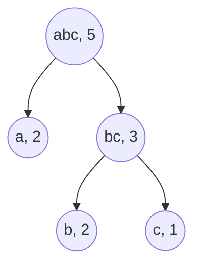
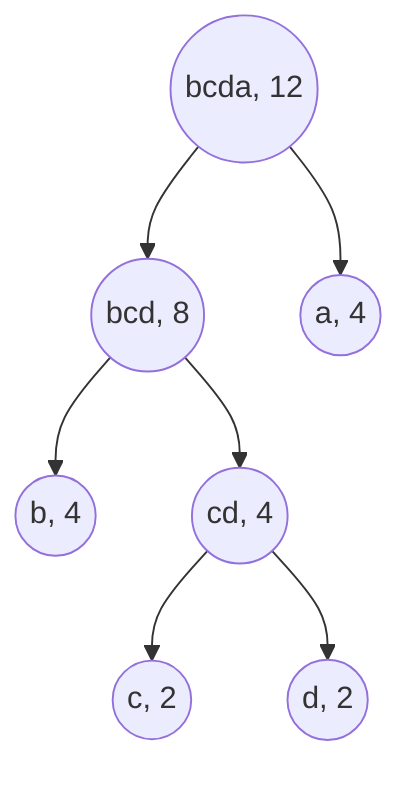
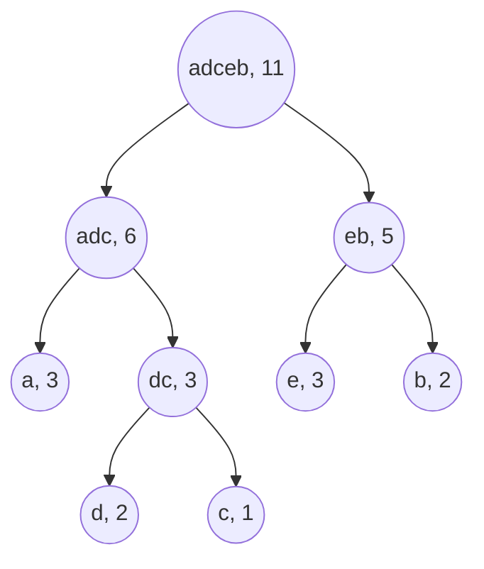
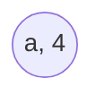

# Huffman coding

## Purpose

The following coding exercises are designed to test your knowledge of the following concepts:

* Huffman coding

## Overview

The coding exercises cover the following practical problems:
* Creating a Huffman coding for a given corpus (text)
* Using Huffman coding to encode a message
* Using Huffman coding to decode a message

## Coding exercises

### Exercise 1: Creating a Huffman coding for a given corpus (text)

Your task is to implement the following static method (and the helper class for representing Huffman coding nodes) to return Huffman coding for a given text:

```java
/**
 * Returns the root of the resulting Huffman coding tree.
 *
 * NOTE: the `text` consists of lowercase symbols from English alphabet only.
 * NOTE: `ALPHABET_SIZE` or `A` will be used to denote the number of distinct
 *   characters in a given text.
 * NOTE: `N` will be used to denote the size of a given text.
 *
 * Two steps are required to build a Huffman coding based on a given text:
 * (1) Calculate and order character frequencies/counts
 * (2) Build a tree that represents the resulting Huffman coding
 *
 * NOTE: The expected time complexity for the first step is O(N + A * log(A)).
 * NOTE: The expected time complexity for the second step is O(A * log(A)).
 *
 * Example: 
 *   (0) text="cabbaa"
 *   (1) character counts = [('a', 3), ('b', 2), ('c', 1)]
 *
 * NOTE: if the frequencies for some characters (nodes) are the same,
 *   order those characters lexicographically.
 *
 *   (2)     ("abc", 5)
 *           |  \
 *           |   \
 *           |    \
 *       ("a", 3)  ("bc", 3)
 *                   |     \
 *                   |      \
 *               ("b", 2)  ("c", 1)
 *
 *       'a' -> "0"
 *       'b' -> "10"
 *       'c' -> "11"
 *
 *
 * @param text a given text that should be used to build the Huffman coding.
 * @return the root of the resulting Huffman coding
 */
public static TreeNode createHuffmanCoding(String text) {
        //put your code here
        return null;
}

// TreeNode.java

public class TreeNode {
    /**
     * Class for tree nodes that will be used to create a Huffman coding.
     */
    private char ch;
    private TreeNode leftNode;
    private TreeNode rightNode;

    public TreeNode(char ch, TreeNode leftNode, TreeNode rightNode) {
        this.ch = ch;
        this.leftNode = leftNode;
        this.rightNode = rightNode;
    }

    public char getCh() {
        return ch;
    }

    public TreeNode getLeftNode() {
        return leftNode;
    }

    public TreeNode getRightNode() {
        return rightNode;
    }
}
```

**Example 1:**

`text`="cabbaa"

Expected output:



The resulting Huffman coding:
* 'a' -> "0"
* 'b' -> "10"
* 'c' -> "11"

**Example 2:**

`text`="aaaabbbbccdd"

Expected output:



The resulting Huffman coding:
* 'a' -> "1"
* 'b' -> "00"
* 'c' -> "010"
* 'd' -> "011"


**Example 3:**

`text`="abcabdedeea"

Expected output:



The resulting Huffman coding:
* 'a' -> "00"
* 'b' -> "11"
* 'c' -> "011"
* 'd' -> "010"
* 'e' -> "10"


**Example 4:**

`text`="aaaa"

Expected output:



The result Huffman coding:
* 'a' -> "0"

<br>

Please use the template `Solution.createHuffmanCoding` and `TreeNode` for the implementation.

### Exercise 2: Encode a given message using Huffman coding

Your task is to implement the following static method to encode a given message using Huffman coding:

```java
/**
 * Returns an encoded message using Huffman coding for a given text.
 *
 * NOTE: the `text` consists of lowercase symbols from English alphabet only.
 *
 * @param text a given text to encode.
 * @param huffmanCodingRoot the root node that represents a given Huffman coding.
 * @return the encoded text.
 */
public static String encodeHuffman(String text, TreeNode huffmanCodingRoot) {
        //put your code here
        return null;
}
```

**Example 1:**

`text`="abacaba"

`huffmanCodingRoot`=


Expected output:

"0100110100"


**Example 2:**

`text`="abacaba"

`huffmanCodingRoot`=


Expected output:

"10010101001"


**Example 3:**

`text`="abacaba"

`huffmanCodingRoot`=


Expected output:

"001100011001100"


**Example 4:**

`text`="aaaa"

`huffmanCodingRoot`=


Expected output:

"0000"

<br>

Please use the template `Solution.encodeHuffman` for the implementation.


### Exercise 3: Decode a given message using Huffman coding

Your task is to implement the following static method to decode a given message using Huffman coding:

```java
/**
 * Uses Huffman coding to return the decoded message for a given text.
 *
 * NOTE: the `text` consists of lowercase symbols from English alphabet only.
 *
 * @param text a given text to decode.
 * @param huffmanCodingRoot the root node that represents a given Huffman coding.
 * @return the decoded text.
 */
public static String decodeHuffman(String text, TreeNode huffmanCodingRoot) {
        //put your code here
        return null;
}
```

**Example 1:**

`text`="0100110100"

`huffmanCodingRoot`=


Expected output:

"abacaba"


**Example 2:**

`text`="10010101001"

`huffmanCodingRoot`=


Expected output:

"abacaba"


**Example 3:**

`text`="001100011001100"

`huffmanCodingRoot`=


Expected output:

"abacaba"


**Example 4:**

`text`="0000"

`huffmanCodingRoot`=


Expected output:

"aaaa"

<br>

Please use the template `Solution.decodeHuffman` for the implementation.
