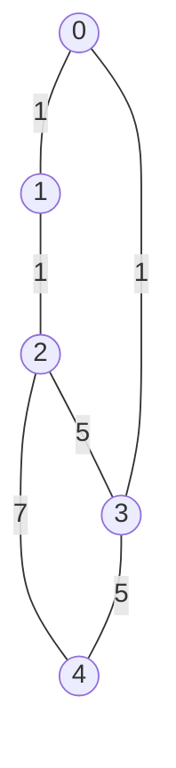
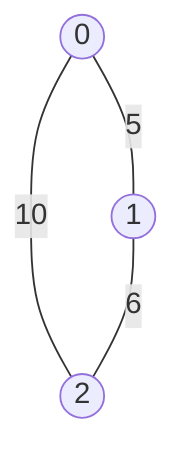
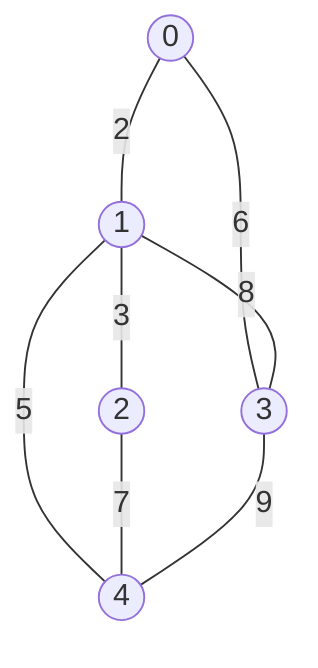
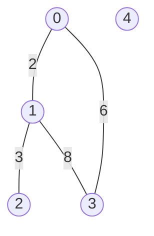

# Minimum Spanning Tree (MST)

## Purpose

The coding exercises are designed to test your knowledge of the following concepts:

* Finding an MST and its weight

## Overview

The coding exercises cover the following practical problems:
* Building an MST using Kruskal's algorithm 
* Building an MST using Prim's algorithm

## Coding exercises

### Exercise 1: Building an MST using Kruskal's algorithm 

Given the number of vertices `n` and graph edges `edges` of an undirected weighted graph, implement the static method below to find out the weight of the MST using Kruskal's algorithm. 
The vertices are enumerated from `0` to `n` exclusively. Each edge in `edges` is a combination of the indexes of the connected vertices and the weight of this edge.

The expected algorithm complexity is `O(MlogM)`, where M is the number of edges, `M << N^2`, and `N` is the number of vertices.


```java
/**
 * Returns the weight of the MST for an undirected weighted graph.
 *
 * The expected algorithm complexity is O(MlogM),
 *   where M is the number of edges, M << n^2, and n is the number of vertices.
 *
 * If no MST exists, please, return `Optional.empty()`.
 *
 * Suppose there is a graph with five vertices from 0 to 5 exclusively and the list of edges
 *   [[0, 1, 1], [0, 2, 1], [2, 3, 5], [0, 3, 1], [2, 4, 7], [3, 4, 5]].
 * Each edge is a combination of its weights and the indexes of the connected vertices.
 * The MST is {(0,1), (0,2), (0,3), (3,4)} and has a weight of 8.
 *
 * @param n the number of vertices in the graph.
 * @param edges contains the indexes of the connected vertices and the weight of this edge.
 * @return the weight of the MST.
 */
public static Optional<Integer> kruskalMST(int n, List<Triplet<Integer, Integer, Integer>> edges) {
        //put your code here
        return Optional.empty();
}
```

Additionally, there is a template for disjoint sets data structure for you to fill in:
```java
/**
 * Class for supporting disjoint sets.
 * NOTE: the expected implementation should contain:
 * "path compression" heuristic
 * "union be rank" heuristic (based on sets size)
 *
 * @param <K> type of key
 */
public class DisjointSets<K> {

    //Think about required fields to support the requirements.
    //define fields here

    /**
     * Creates a new set that is associated to a given key.
     * @param key the key
     */
    public void makeSet(K key) {
        //put your code here
    }

    /**
     * Returns a unique set identifier (key) of a given's key set.
     * NOTE: "path compression" heuristic is expected to be used.
     *
     * @param key the key
     * @return the unique set identifier
     */
    public K findSet(K key) {
        //put your code here
        return null;
    }

    /**
     * Joins two given sets into a new one.
     * NOTE: "union by rank" heuristic is expected to be used (based on sets size).
     * NOTE: if the sets that correspond to the given keys are of the same rank -
     * prefer the second set when deciding what set is to be used as a new "root".
     *
     * @param firstKey the key of a first set
     * @param secondKey the key of a second set
     */
    public void unionSets(K firstKey, K secondKey) {
        //put your code here
    }

}
```

**Example 1:**

`n` = 5
`edges` = [[0, 1, 1], [0, 2, 1], [2, 3, 5], [0, 3, 1], [2, 4, 7], [3, 4, 5]]

Expected result: 8.

**Example 2:**

`n` = 3
`edges` = [[1, 0, 5], [2, 0, 10], [1, 2, 6]]

Expected result: 11.

<br/>

Please use the templates `Solution.kruskalMST` and `DisjointSets` for the implementation.


### Exercise 2: Building an MST using Prim's algorithm

Given the number of vertices `n` and the graph adjacency weighted matrix `edges` for an undirected weighted graph, implement the function below, which returns the order of adding vertices to the MST according to the Prim's algorithm and its weight. 

The expected algorithm complexity is `O(N^2)`, where `N` is the number of vertices; `M ~ N^2`, and `M` is the number of edges.
The vertices are enumerated from `0` to `n` exclusively.

The starting vertex should be 0. If several vertices can be chosen at any iteration, the one with the smallest index should be added.

```java
/**
 * Returns the order of adding vertices to the MST according to Prim's algorithm and
 *   the weight of the MST for an undirected weighted graph.
 *
 * The expected algorithm complexity is O(n^2).
 *
 * The starting vertex should be 0.
 *
 * If several vertices can be chosen at any iteration, 
 *   the one with the smallest index should be added.
 *
 * If no MST exists, please, return `Optional.empty()`.
 *
 * Suppose there is a graph with five vertices from 0 to 5 exclusively and an adjacency matrix
 * [[0, 2, 0, 6, 0], 
 *  [2, 0, 3, 8, 5], 
 *  [0, 3, 0, 0, 7], 
 *  [6, 8, 0, 0, 9], 
 *  [0, 5, 7, 9, 0]]
 *
 * 0 means the absence of an edge, and a positive value means an edge exists and shows its weight.
 * The MST is {(0,1), (1,2), (0,3), (1,4)} with a weight of 16.
 * The vertices are added to the MST in the following order [0, 1, 2, 4, 3].
 *
 * @param n the number of vertices in the graph.
 * @param adjacencyMatrix the adjacency matrix.
 * @return the order of adding vertices to the MST, the weight of the MST.
 */
public static Optional<Pair<Integer[], Integer>> primMST(int n, int[][] adjacencyMatrix) {
        //put your code here
        return Optional.empty();
}
```

**Example 1:**

`n = 5`

`adjacencyMatrix = [[0, 2, 0, 6, 0], [2, 0, 3, 8, 5], [0, 3, 0, 0, 7], [6, 8, 0, 0, 9], [0, 5, 7, 9, 0]]`

Expected result: `[0, 1, 2, 4, 3]`, `16`

**Example 2:**


`n = 5`

`adjacencyMatrix = [[0, 2, 0, 6, 0], [2, 0, 3, 8, 0], [0, 3, 0, 0, 0], [6, 8, 0, 0, 0], [0, 0, 0, 0, 0]]`

Expected result: `Optional.empty()`

<br/>

Please use the template `Solution.primMST` for the implementation.
