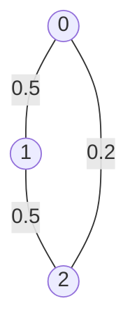
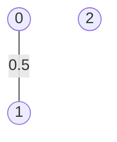
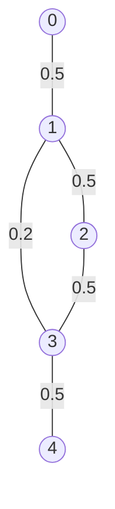
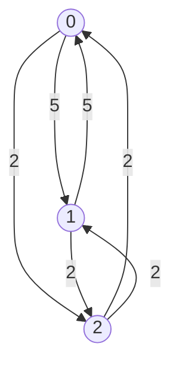
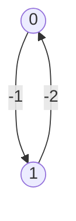
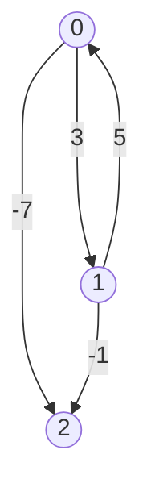
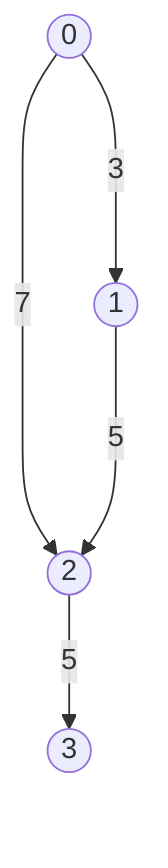

# Single-source shortest paths

## Purpose

The coding exercises are designed to test your knowledge of the following concepts:

* Dijkstra's algorithm
* Bellman-Ford's algorithm

## Overview

The coding exercises cover the following practical problems:
* Finding the most probable path
* Finding single-source shortest paths with negative edges

## Coding exercises

### Exercise 1: Finding the most probable path 

Given the number of vertices `n` and graph edges `edges` of an undirected weighted graph, implement the static method below to find out the most probable (`v`, `u`)-path. 
Vertices are enumerated from `0` to `n-1`. `edges` is a dictionary where key is a source vertex and value is a set of combinations of the destination vertex and weight.
Each weight of (`u`, `v`)-edge represents the probability of successfully traversing from `u` to `v` and vice versa.

The expected algorithm complexity is `O(N*N)`, where N (`n`) is the number of vertices.

If no (`v`, `u`)-path exists, please, return 0.

```java
/**
 * Returns the maximum probability of getting from vertex `v` to vertex `u` in an undirected weighted graph.
 *
 * The weight of (u,v)-edge represents the probability of successfully of traversing 
 *   from 'u' to 'v' and vice versa.
 *
 * The expected algorithm complexity is O(n^2), where n is the number of vertices.
 *   Vertices are enumerated from 0 to N-1.
 *
 * If no (v,u)-path exists, please, return 0.
 *
 * Your answer will be accepted if it differs from the correct answer by 1e-5 or less.
 *
 * For example, there is a graph with three vertices from 0 to 2 and the following edges:
 *   {0: {(1, 0.5), (2, 0.2)), 1: {(0, 0.5), (2, 0.5)}, 2: {(0, 0.2), (1, 0.5)}}
 * If the starting vertex is 0 and the ending vertex is 2, the expected result is 0.25.
 * There are two paths from start to end, one (0 -> 2) with a probability of success of 0.2
 *   the other (0 -> 1 -> 2) with a probability of 0.5 * 0.5 = 0.25.
 *
 * @param n the number of vertices in the graph, numbered from 0 to n-1.
 * @param edges the adjacency dictionary, which stores a set of adjacent vertices 
 *   and its weights for each vertex.
 * @param vertexV start vertex.
 * @param vertexU finish vertex.
 * @return the maximum probability of getting from vertex `v` to vertex `u`.
 */
public static double getMaximumProbabilityPath(
        int n,
        Map<Integer, Map<Integer, Double>> edges,
        int vertexV,
        int vertexU
        ) {
        //put your code here
        return 0.0;
}
```

**Example 1:**

`n` = 3
<br>
`edges` = `{0: {1: 0.5, 2: 0.2}, 1: {0: 0.5, 2: 0.5}, 2: {0: 0.2, 1: 0.5}}`
<br>
`v`=`0`
<br>
`u`=`2`

Expected result: 0.25.

**Example 2:**

`n` = 3
<br>
`edges` = `{0: {1: 0.5, 2: 0.3}, 1: {0: 0.5, 2: 0.5}, 2: {0: 0.3, 1: 0.5}}`
<br>
`v`=`0`
<br>
`u`=`2`

Expected result: 0.3.

**Example 3:**

`n` = 3
<br>
`edges` = `{0: {1: 0.5}, 1: {0: 0.5}}`
<br>
`v`=`0`
<br>
`u`=`2`

Expected result: 0.

**Example 4:**

`n` = 5
<br>
`edges` = `{0: {1: 0.5}, 1: {0: 0.5, 2: 0.5, 3: 0.2}, 2: {1: 0.5, 3: 0.5}, 3: {1: 0.2, 2: 0.5, 4: 0.5}, 4: {3: 0.5}}`
<br>
`v`=`0`
<br>
`u`=`4`

Expected result: 0.0625.

<br/>

Please use the template `Solution.getMaximumProbabilityPath` for the implementation.


### Exercise 2: Finding single-source shortest paths with negative edges

Given the number of vertices `n` and graph edges `edges` of a directed weighted graph, implement the function below to return two values. The first argument is the sum of the minimum cost paths from vertex `v` to all achievable vertices. The second is the number of unachievable vertices. 
Vertices are enumerated from `0` to `n-1`. `edges` is a dictionary where key is a source vertex and value is a set of combinations of the destination vertex and weight.
Each weight of (`u`, `v`)-edge represents the cost of traversing from `u` to `v`. Weights can be negative, and there can also be negative cycles.

The expected algorithm complexity is `O(N*M)`, where `N` is the number of vertices and `M` is the number of edges.

```java
/**
 * Returns a pair of integers, where the first value is the sum of minimum cost paths from vertex `v`
 *   to all achievable vertices and the second is the number of unachievable vertices
 *   from vertex `v` in a directed weighted graph.
 *
 * The weight of (u,v)-edge represents a cost of traversing from 'u' to 'v'.
 *
 * NOTE: Weights can be negative, and there can also be negative cycles.
 * NOTE: If there is a negative cycle, please return Optional.empty().
 *
 * The expected algorithm complexity is O(N*M), where N is the number of vertices and M is the number of edges.
 *
 * For example, there is a graph with four vertices from 0 to 3 and the following edges/weights:
 *   {0: {(1, 3), (2, 7)}, 1: {(2, 5)}, 2: {(3, 5)}}
 * If the starting vertex is 1, the expected result is (15, 1).
 * Vertex 0 is the only unachievable vertex from vertex 1.
 * The cost of getting a vertex that is equal to the starting vertex is 0, 
 *   the (1,2)-path min cost is 5 and (1,3)-path min cost is 10 (1 -> 2 -> 3).
 *
 * @param n number of vertices in the graph, vertices are enumerated from 0 to n-1.
 * @param edges adjacency dictionary which stores a set of adjacent vertices and the weights for each vertex.
 * @param vertexV start vertex.
 * @return the sum of the minimum cost paths from vertex `v` to all achievable vertices 
 *   and the number of unachievable vertices from vertex 'v'
 */
public static Optional<Pair<Integer, Integer>> findShortestPathsCost(
        int n,
        Map<Integer, Map<Integer, Integer>> edges,
        int vertexV
        ) {
        //put your code here
        return Optional.empty();
}
```

**Example 1:**

`n` = `3`
<br>
`v` = `0`
<br>
`edges` = `{0: {1: 5, 2: 2}, 1: {0: 5, 2: 2}, 2: {0: 2, 1: 2}}`

Expected result: `(6, 0)`

**Example 2:**

`n` = `2`
<br>
`v` = `2`
<br>
`edges` = `{0: {1: -1}, 1: {0: -2}}`

Expected result: `null`
<br>
Explanation: there is a negative cycle.

**Example 3:**

`n` = `3`
<br>
`v` = `1`
<br>
`edges` = `{0: {1: 3, 2: -7}, 1: {0: 5, 2: -1}}`

Expected result: `(3, 0)`
<br>
Explanation: (1, 0)-path has the lowest cost of 5 (1 -> 0) and (1, 2)-path has the lowest cost of -2 (1 -> 0 -> 1).

**Example 4:**

`n` = `4`
<br>
`v` = `1`
<br>
`edges` = `{0: {1: 3, 2: 7}, 1: {2: 5}, 2: {3: 5}}`

Expected result: `(15, 1)`
<br>
Explanation: no (1, 0)-path exists, (1, 2)-path has the lowest cost of 5 (1 -> 2) and (1, 3)-path has the lowest cost of 10 (1 -> 2 -> 3).

**Example 5:**

`n` = `4`
<br>
`v` = `0`
<br>
`edges` = `{0: {1: 3, 2: 7}, 1: {2: 5}, 2: {3: 5}}`

Expected result: `(22, 0)`

<br/>

Please use the template `Solution.findShortestPathsCost` for the implementation.
