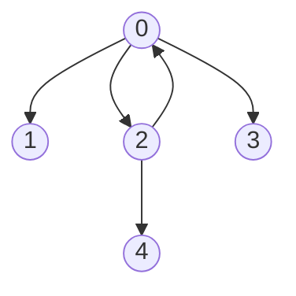
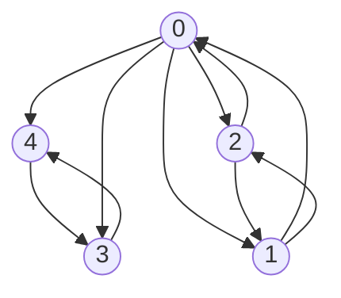

# Strongly connected components

## Purpose

The coding exercise is designed to test your knowledge of the following concepts:

* Finding strongly connected components  

## Overview

The coding exercise covers the following practical problems:
* Calculating the number of strongly connected components in a directed graph 

## Coding exercises

### Exercise 1: Calculating the number of strongly connected components in a directed graph

Given the number of vertices `n` and edges `edges` for a directed graph, implement the static method below to calculate the number of strongly connected components. Vertices are enumerated from `0` to `n` exclusively.

```java
/**
 * Returns the number of strongly connected components in a directed graph.
 *
 * For example, there is a graph with six vertices from 0 to 6 exclusively and the edges
 *   {{0,1}, (0,5), {1,5}, {5,0}, {3,4}, (4,3)}.
 * There are tree strongly connected components: {0, 5, 1}, {2} and {3,4}.
 * The edges above will have the following 'adjacency dictionary' representation:
 *   {0: {1,5}, 1: {5}, 3: {4}, 4: {3}, 5: {0}}.
 *
 * @param n the number of vertices in the graph.
 * @param edges the adjacency dictionary which stores a set of adjacent vertices for each vertex.
 */
public static int findNumberOfSCC(int n, Map<Integer, Set<Integer>> edges) {
        //put your code here
        return 0;
}
```

**Example 1:**

`n = 6` 

`edges = {0: {1, 2, 3}, 2: {0, 4}}`

This directed graph looks like the following:



Expected result: 4


**Example 2:**

`n = 5` 

`edges = {0: {1, 2, 3, 4}, 1: {0, 2}, 2: {0, 1}, 3: {4}, 4: {3}}`

This directed graph looks like the following:



Expected result: 2

<br/>

Please use the template `Solution.findNumberOfSCC` for the implementation.
